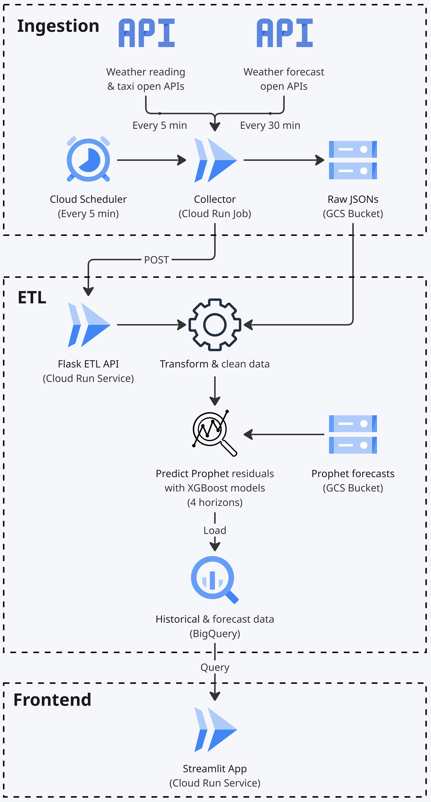

# Singapore Taxi Availability Forecast

This project was a real-time forecasting tool that estimated **2-hour future taxi availability across Singapore** using live location data and weather conditions.
Built with a full GCP-based pipeline and visualized through an interactive Streamlit app, this tool demonstrated how cloud infrastructure and ML can generate **short-term mobility insights**.

⚠️ **Note**: The live beta app at [sgtaxiforecast.com](https://sgtaxiforecast.com) has been **decommissioned**.
This repository now serves as a reference archive with the final architecture and demo.

## 🚕 Problem Statement & Business Relevance

**Taxi availability** acts as a useful proxy for urban transport **demand and supply dynamics**. Understanding how availability shifts based on time, weather, and location can help:

- **Consumers**: Anticipate peak periods and plan ahead when booking a taxi or ride-hailing service.
- **Transport Operators**: Optimize driver deployment and reduce passenger wait times.
- **Urban Planners & Government Agencies**: Gain insights into commuter behavior and demand hotspots to inform mobility policy or infrastructure planning.
- **Logistics & Delivery Firms**: Strategize dispatching by aligning with short-term traffic and transport flow.

This tool showcases how **open transport data** can be combined with **cloud infrastructure** and **machine learning** to produce actionable insights in a scalable and reproducible manner.

## 📊 Demo & Architecture

### System Architecture

### Dashboard Demo (1-min screen recording)
<video src="docs/app_demo.mp4" controls width="600"></video>

## 📁 Project Structure
├── collector/ # Cloud Run job that pulls live taxi & weather data every 5 mins  
├── config/ # Configuration for regional/area mappings, time regressors and ML model  
├── etl/ # Flask-based ETL API for transforming and loading into BigQuery  
├── streamlit_app/ # Frontend dashboard visualizing trends and forecast  
├── docs/ # System architecture and Dashboard demo